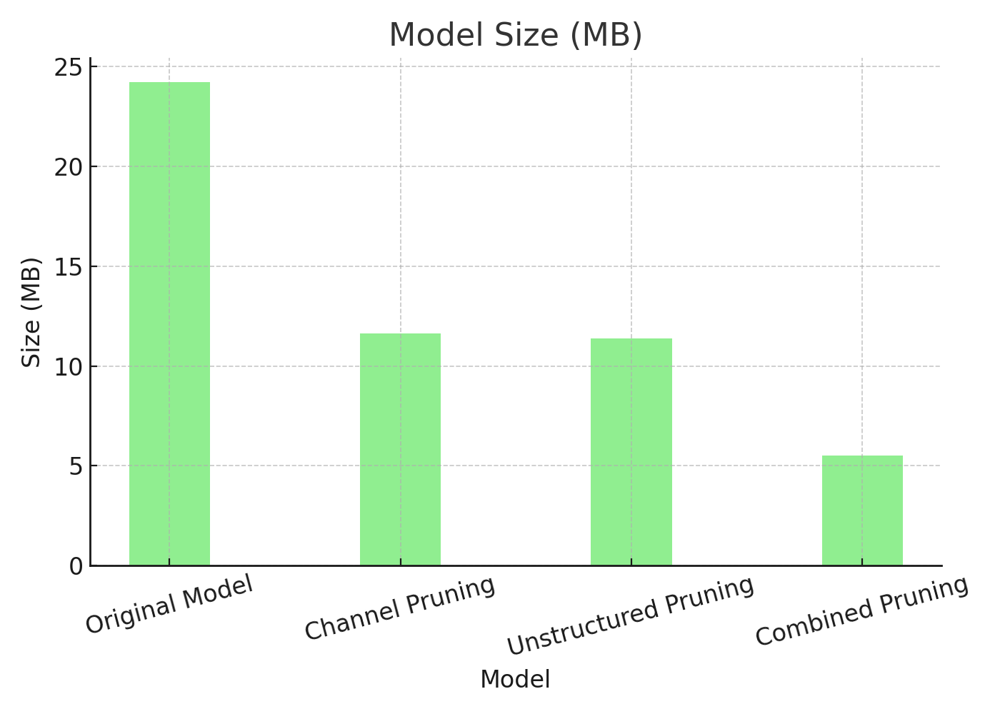
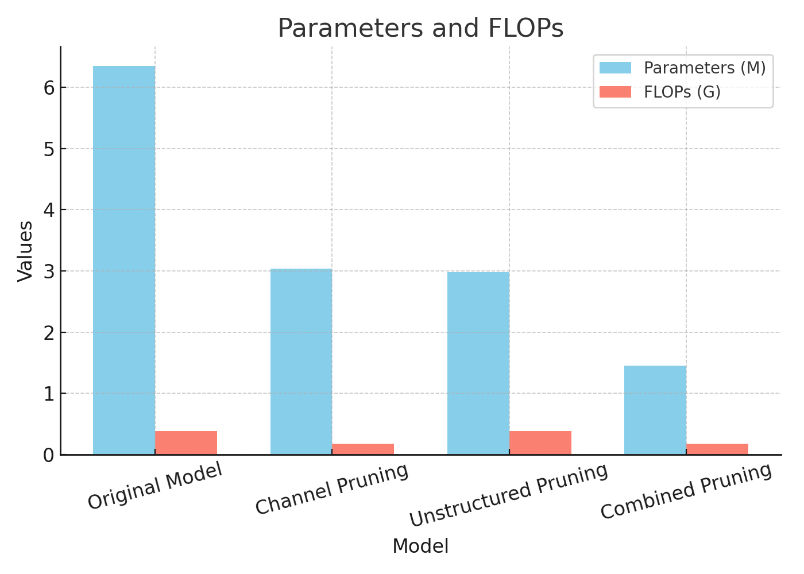

## Model Pruning for Efficient Time Series Forecasting

As machine learning models grow in complexity, deploying them in real-world environments—especially on resource-constrained devices—requires a shift from “bigger is better” to “smaller and smarter.” One powerful method to achieve this is **model pruning**.

### What is Pruning?

Pruning is a technique that removes less important parts of a neural network (such as weights or neurons), reducing the overall size and computational cost of the model. This process leads to more efficient models that can run faster and require fewer resources, often with little or no drop in predictive performance.

The following two pruning techniques are applied to reduce model complexity and improve efficiency:

---

### 1. **Unstructured (Fine-Grained) Pruning**

Unstructured pruning removes individual weights from the network based on their importance. This type of pruning leads to *sparse* weight matrices and can significantly reduce parameter count.

- Typically applied based on magnitude or statistical criteria.
- Maintains model architecture but zeroes out less significant weights.
- **Requires sparse-aware hardware or libraries** to realize speed or efficiency gains in practice.

---

### 2. **Structured (Channel) Pruning**

Structured pruning removes entire neurons, channels, or attention heads, resulting in a physically smaller model with fewer operations (FLOPs). This is especially beneficial for hardware acceleration.

- Applied at a higher architectural level.
- Results in reduced model size and faster inference.
- Maintains dense weight matrices, making it highly compatible with standard hardware like CPUs and GPUs.

---

### Combining Techniques

In practice, combining unstructured and structured pruning provides a balanced trade-off:

- **Unstructured pruning** reduces redundancy in weights.
- **Structured pruning** optimizes the model for deployment.
- The result is a smaller, faster model that can still match original performance when fine-tuned.

---

### Why Pruning Matters for SEDIMARK
In the context of the SEDIMARK project, which focuses on secure, efficient, and decentralized AI workflows, pruning plays a vital role in optimizing model deployment across diverse and potentially resource-limited environments. By reducing model size and computational load, pruning enables faster inference and lower energy consumption — both critical for real-world deployment on edge devices and within federated learning systems integral to SEDIMARK's architecture.

---

## Evaluation and Results

In our internal experiments, applying pruning to transformer-based time series models demonstrated clear benefits:

- **Model size** was significantly reduced—ranging from approximately **50% with structured pruning alone** to **up to 80% when combining both techniques**.
- **FLOPs** and memory requirements dropped substantially with structured pruning.
- **Forecasting performance** remained comparable to the original models—and in some cases, improved slightly due to the regularization effect of pruning.

Different pruning strategies showed strengths in different areas:

- **Channel pruning** delivers substantial reductions in both model size and computation. Because it preserves dense weight structures, it’s highly compatible with existing hardware accelerators—ideal for real-time, edge, or mobile deployments.
- **Unstructured pruning** reduces parameter count and can improve error metrics such as MAE or MSE. However, since it introduces irregular sparsity, it requires sparse-aware hardware (e.g., optimized libraries or specialized accelerators) to unlock real-world runtime benefits.
- **Combined pruning** provides the best of both worlds: a high degree of compression with a good balance between model sparsity and computational reduction. It’s especially practical when both storage and inference efficiency are critical.

### Benchmark Graph

You can refer to the graph above for a visual representation of the benchmarking results.

## Acknowledgement

This software has been developed by the [University of Surrey](https://www.surrey.ac.uk/) under the [SEDIMARK(SEcure Decentralised Intelligent Data MARKetplace)](https://sedimark.eu/) project. SEDIMARK is funded by the European Union under the Horizon Europe framework programme [grant no. 101070074]. This project is also partly funded by UK Research and Innovation (UKRI) under the UK government’s Horizon Europe funding guarantee [grant no. 10043699].
